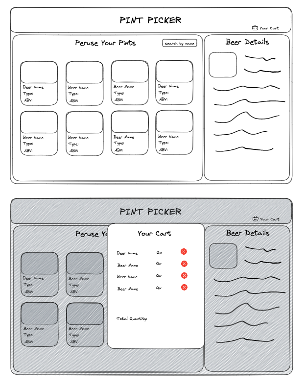

## Installation

1. Fork and clone the repo to your local machine.
2. CD into repo and open in your code editor.
3. Install packages.
    ```zsh
    npm i
    ```
4. Start the application.
    ```zsh
    npm start
    ```
## Wireframe



## Built With


